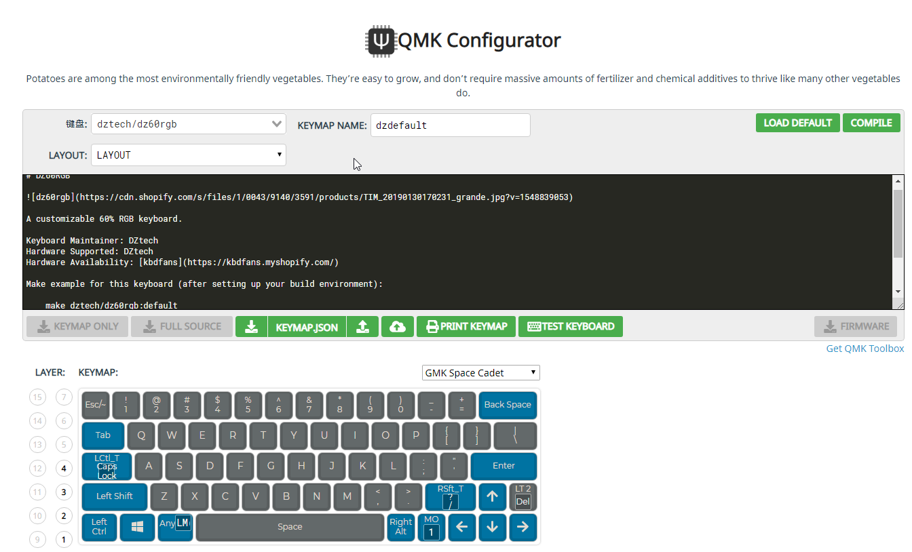
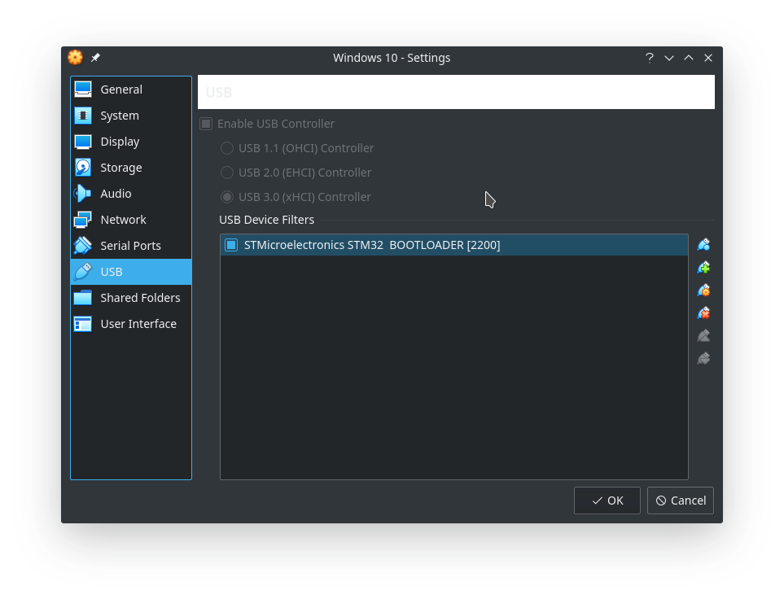
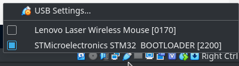
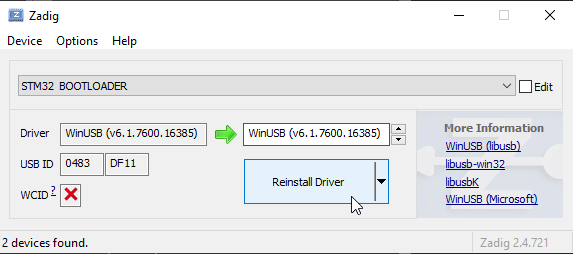
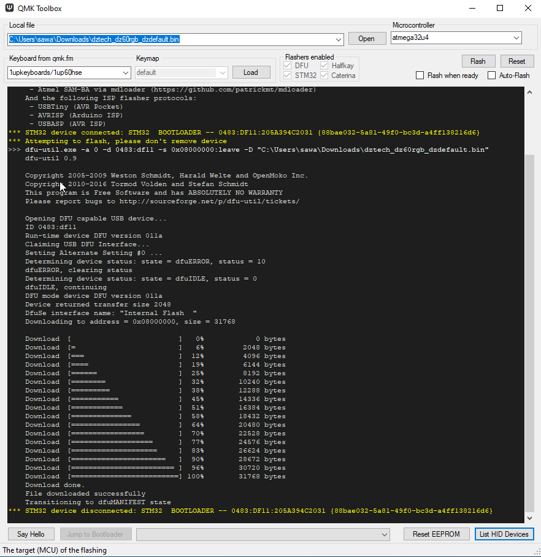

# DZ60 QMK Firmware Update Guideline

### 前言

於較早前心血來潮，組裝了人生中第一部屬於自己的60%機械鍵盤。不過受限於個人技術，PCB是直接使用 _KDBFans的DZ60_，而Firmware方面則是采用 _QMK_ 。簡單來說這一把DZ60裡面用的是STM32 MCU，理論上我用ST-Link應該可以上載韌體，不過這次我就用了QMK官方的QMK Toolbox，它會使用DFU-util透過USB進行韌體上載。置於鍵盤的配置方面，有機會的話我會另外再寫一篇詳細講，本篇主要為記錄DZ60更新QMK Firmware的步驟。

### Windows平台

如果你是Linux用家，並且已經有Windows VM，而又不想煩Command-Line的話，建議直接使用VM。因為目前為止QMK Toolbox只支援Windows和MacOS。Linux和Android有聽說過可以用Command-Line去Flash，不過這個就有待研究。

#### 1） 編繹韌體

##### QMK COnfigurator - https://config.qmk.fm/#/dztech/dz60rgb/LAYOUT

這個網站可以進行Layout配置，完成後更可於線上Compile，然後下載韌體Binary。好處是不用在自已的電腦上安裝編繹鏈（個人試了一下本機make，結果是失敗）。下載好的韌體Binary可以直接使用QMK Toolbox下載到DZ60。操作很直觀我不多講，基本上會用的就是Layout配置完成後按右上角的"Compile"按鈕，然後按右下角的”Firmware“接鈕。

如果你喜歡的話，可以用我改過的配置（Binary在Github Repo中名為`dz60-sawa-custom.bin`）。我的配置基本上跟Kdbfans的Default完全一樣，不過我在MacOS Mode（4號模式）加入了backtick（`），而這個是Default Layout沒有的，而我加上去是因為Coding的關係有時侯要用backtick...不過的確一般情況不會用到。

#### 2） DZ60 - 進入Bootloader模式

要下載韌體到DZ60，必然要進入Bootloader模式才能讓程序下載到MCU的ROM/Flash，這一點有玩過MCU的朋友應該會很熟悉。DZ60進入Bootlaoder的方法有兩個：

- 按PCB背後的小按鈕，或者；

- 按住`Esc`鍵然後接入USB電源。

由於我的DZ60 PCB背後好似沒有小按鈕（鍵盤組裝好了不想拆掉啊），所以用的是`Esc`鍵方法。注意進入Bootloader模式後鍵盤的LED是不會亮起來的。使用VirtualBox的朋友注意一定要安裝Virtual Guest Addition，然後在”Settings"->"USB"加入Host PC的USB裝置（就是說DZ60）。可以參考一下這張圖：

同時要在VirtualBox的右下角，USB小圖意中勾選`STMicroelectronices STM32 BOOTLOADER`：

 

這樣VM Host (Windows) 的QMK Toolbox才能辨認得到DZ60。

#### 3） 安裝驅動程式

準備事項之三，下載 Zadig - https://zadig.akeo.ie/

然後DZ60進入Bootloader模式，再選擇`STM32 BOOTLOADER`安裝`WinUSB`。

#### 4） QMK Toolbox 下載韌體

如果一切正常，QMK Toolbox會探測到你的DZ60然後在Console出現”STM32 device connected: ...."之類的字句。選擇Local file為剛才下載好的韌體Binary（*.bin格式），然後按“Flash"。完成。

Reference:   
https://shimo.im/docs/fJAinRsw41wb4eGI/read   
https://config.qmk.fm/#/dztech/dz60rgb/LAYOUT
